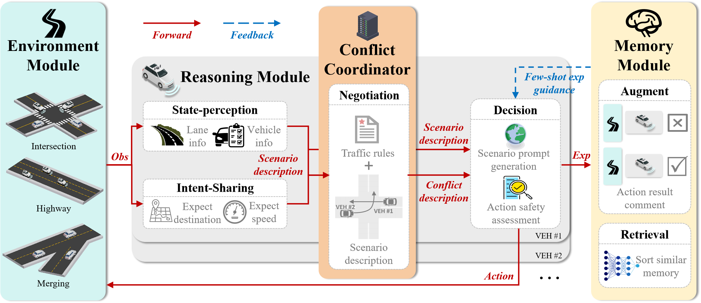

# Towards Interactive and Learnable Cooperative Driving Automation: a Large Language Model-Driven Decision-making Framework

## Abstract
At present, Connected Autonomous Vehicles (CAVs) have begun to open road testing around the world, but their safety and efficiency performance in complex scenarios is still not satisfactory. Cooperative driving leverages the connectivity ability of CAVs to achieve synergies greater than the sum of their parts, making it a promising approach to improving CAV performance in complex scenarios. However, the lack of interaction and continuous learning ability limits current cooperative driving to single-scenario applications and specific Cooperative Driving Automation (CDA). To address these challenges, this paper proposes CoDrivingLLM, an interactive and learnable LLM-driven cooperative driving framework, to achieve all-scenario and all-CDA. First, since Large Language Models(LLMs) are not adept at handling mathematical calculations, an environment module is introduced to update vehicle positions based on semantic decisions, thus avoiding potential errors from direct LLM control of vehicle positions. Second, based on the four levels of CDA defined by the SAE J3216 standard, we propose a Chain-of-Thought (COT) based reasoning module that includes state perception, intent sharing, negotiation, and decision-making, enhancing the stability of LLMs in multi-step reasoning tasks. Centralized conflict resolution is then managed through a conflict coordinator in the reasoning process. Finally, by introducing a memory module and employing retrieval-augmented generation, CAVs are endowed with the ability to learn from their past experiences. We validate the proposed CoDrivingLLM through ablation experiments on the negotiation module, reasoning with different shots experience, and comparison with other cooperative driving methods.

## Motivation and Method Overview
With the increasing maturity of autonomous driving technology, manufacturers have shifted from focusing on early-stage technical competition to prioritizing commercial deployment. However, CAVs still exhibit various problems on open roads and even become the culprit of many congestion or accidents. In certain scenarios, the accident rate of CAVs even reached 5.25 times that of human drivers, which has failed to meet people's expectations for autonomous driving technology, and is gradually eroding people's trust in CAVs. The communication capabilities of CAVs enable connectivity and mutual assistance. Therefore, leveraging cooperative driving capabilities is a promising way to enhance CAV performance.

Although much research has been carried out on cooperative driving, these studies are often oriented to single-function of single-scenario, resulting in limited generalizability and difficulty in handling complex and dynamic real-world environments. To create a comprehensive method for cooperative automation across all-scenario, all-level cooperative automation, it is important to enhance interactive and continuous learning abilities.

LLMs possess strong comprehension and reasoning abilities, allowing them to use their extensive world knowledge to interact with other vehicles. Therefore, this paper introduces an interactive and learnable cooperative driving framework based on LLM. However, LLMs may occasionally produce erroneous results when handling complex tasks due to ineffective multi-step reasoning. To address this, this paper constructs a block-sequential reasoning module and combines Chain-of-Thought (CoT) methodology to improve the model's reasoning ability when facing complex tasks as shown in Fig.~\ref{problem}. By integrating state perception, intention negotiation, and decision execution, the cooperative driving ability of CAV for different scenarios is greatly improved. Additionally, memory modules are introduced to store and retrieve past driving experiences and decision results, enabling the avoidance of repeated mistakes and facilitating continuous learning.

## Experiments and Analysis
To verify whether the proposed CoDrivingLLM can effectively improve the interaction ability and learning ability of CAV, this section carries out verification from three aspects. Firstly, ablation experiments were conducted on the negotiation module in different scenarios. Second, we compared the performance of CoDrivingLLM in different scenarios under 0-shot, 2-shots and 5-shots experiences. Finally, we evaluated the safety and efficiency of CoDrivingLLM against other cooperative driving methods, including optimization-based, rule-based, and machine learning-based methods. **Here we focus on showing the operation of each experiment through video. Please refer to the full-text for details of the experiment results.**

### Ablation Study on Negotiation
Lack of interaction ability is an important reason for the current CAV's struggle on the open road. Cooperative driving, through the sharing of states and intentions, can provide additional information to help conflicting parties align their decision-making. To achieve this, we introduce a negotiation module into the reasoning process. By establishing an LLM-driven conflict coordinator, the traffic rules and scenario description are integrated to produce a suggested traffic sequence to assist the final decision, thus improving the interaction ability. To verify the effectiveness of the conflict coordinator in improving interaction, we select an example case to analyze how the negotiation function can improve safety.

| <video muted controls width=380> <source src="./src/case1-without.mp4"  type="video/mp4"> </video> <video muted controls width=380> <source src="./src/case1-with.mp4"  type="video/mp4"> </video> |

The video on the left shows the real-time vehicle state without the negotiation module. It is not difficult to find that due to the lack of the negotiation module, both vehicles to the conflict believe that they have the "right of way" in the conflict and can pass the intersection first, and this misunderstanding ultimately leads to the failure to brake in time and the collision. The video on the right shows that under the central-distributed coupled architecture proposed by us, vehicles can make their own decisions distributed according to the peer sequence suggestions generated by the centralization conflict coordinator. 

Videos of other scenarios (highway, merge) can be found **[Here](https://github.com/FanGShiYuu/CoDrivingLLM)**, where ./without_negotiation folder represents CoDrivingLLM without a negotiation module.

### Comparison with Memory Module
Novice drivers accumulate experience through continuous driving practice, evaluate the effects of different behaviors, and learn from them to improve their driving skills. Drawing on this mechanism, a memory module is introduced to enable CAVs to learn from past experiences and utilize this knowledge to future interactions. We also use a video comparison to demonstrate the effectiveness of memory modules.

| <video muted controls width=380> <source src="./src/case2-0shot.mp4"  type="video/mp4"> </video> <video muted controls width=380> <source src="./src/case2-2shot.mp4"  type="video/mp4"> </video> |

The video on the left shows the vehicle in action without the memory module. At this point, the vehicle's late braking resulted in a rear-end collision. In the video on the right, in the case of a memory module, when the vehicle encounters a situation similar to the video on the left, it can absorb the previous error, and then avoid the collision, and finally achieve safe passage.
